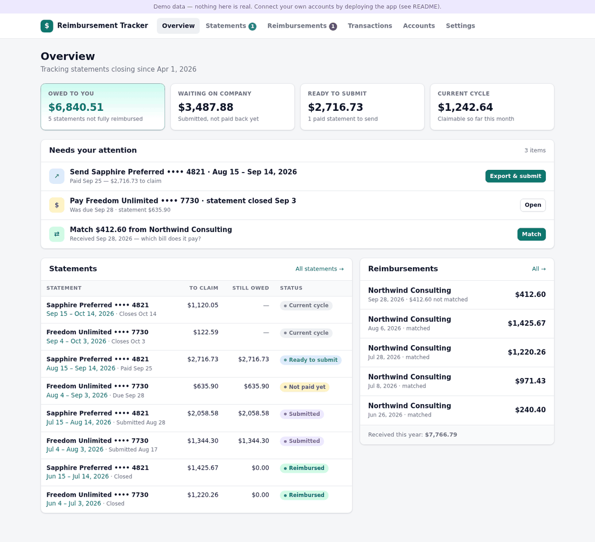
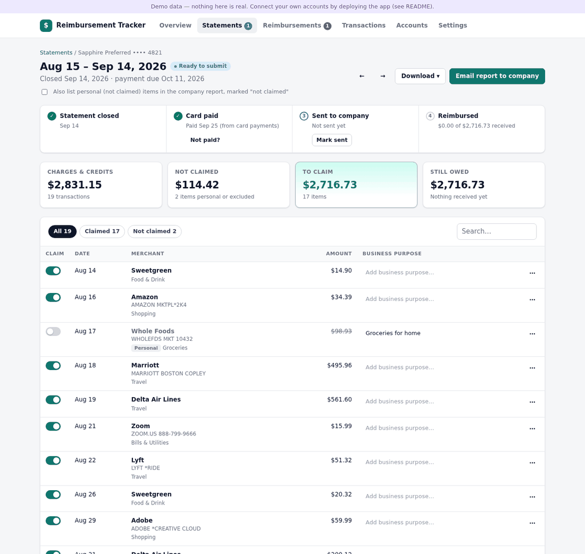
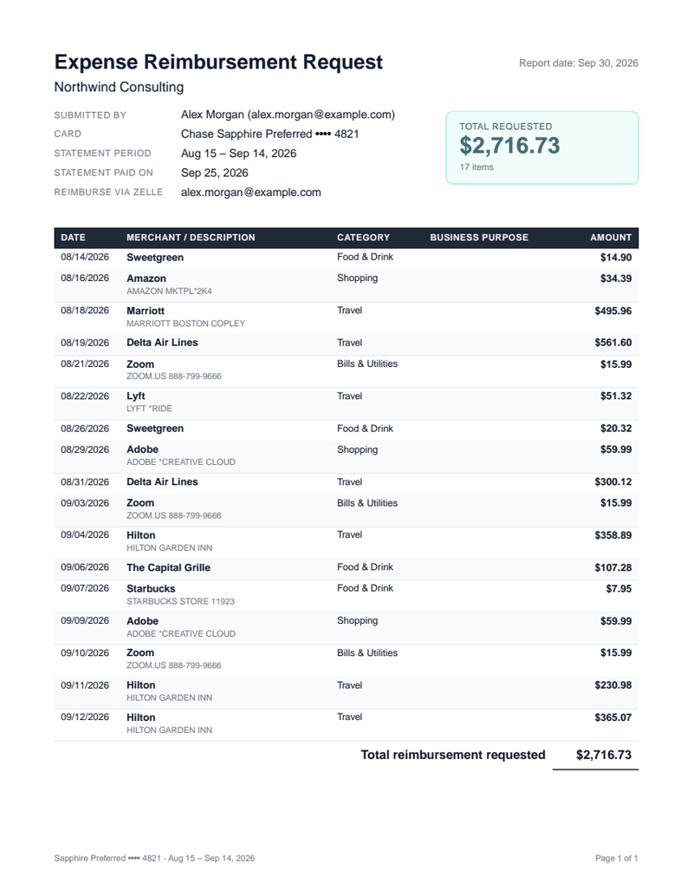

# Reimbursement Tracker

Track the work expenses you put on your own Chase credit cards, statement by statement, and see exactly what your company has paid you back (by Zelle) and what it still owes you.

- **Connects to Chase** through [Plaid](https://plaid.com) (free Trial plan) or [SimpleFIN Bridge](https://beta-bridge.simplefin.org) ($15/year), or by importing the CSV you download from chase.com.
- **Groups transactions into bills** using each card's statement closing date.
- **Everything is reimbursable by default.** Switch off a personal charge, claim only part of one, or add an "always exclude" rule (e.g. Netflix). Card fees, interest and rewards redemptions start out excluded (you can change that in Settings).
- **Go back through your history** on the **Classify** page: statement by statement, mark what was business or personal (keyboard shortcuts included), apply a choice to every charge from the same merchant, and mark old statements you were already paid back for as reimbursed.
- **Follows each bill**: statement closed → card paid (detected from your card payment) → sent to the company → reimbursed.
- **Matches incoming Zelle payments** from your company to bills automatically, including one payment covering several bills. Partial payments are tracked until the rest arrives.
- **Exports every bill**: a PDF, Excel or CSV report for your company (claimed items, business purpose, total, where to send the money) and a tracking workbook/CSV for your own records. You can also export everything at once.

| Overview | A statement |
| --- | --- |
|  |  |

<p align="center"></p>

**Stack:** static web app plus one Express API function on **Vercel**, **Cloud Firestore** as the database, and **Firebase Authentication** (Google sign-in, limited to your email). No build step.

---

## Try it in one minute (demo data)

Needs Node.js 22 or newer.

```bash
npm install
npm run demo
```

Open http://localhost:3000. The demo shows realistic sample statements, Zelle payments and exceptions, and keeps everything in memory. Nothing is sent anywhere.

---

## Set it up for real

You need three free accounts: Firebase, Vercel and Plaid (or SimpleFIN instead of Plaid). Setup takes about 20 minutes.

### 1. Firebase (database + sign-in)

1. Create a project at [console.firebase.google.com](https://console.firebase.google.com). Google Analytics is not needed. The free Spark plan is enough.
2. **Build → Firestore Database → Create database** and choose **production mode** and a location near you (e.g. `nam5`).
   Production mode blocks all direct browser access, which is what this app wants: only its server talks to Firestore. The same rules are in [`firestore.rules`](firestore.rules). To push them yourself, run `npx firebase-tools deploy --only firestore:rules --project <project-id>`.
3. **Build → Authentication → Get started → Sign-in method → Google → Enable.**
4. **Project settings → General → Your apps → Web (`</>`)**: register an app and copy `apiKey`, `authDomain` and `appId`.
5. **Project settings → Service accounts → Generate new private key.** This downloads a JSON key. Turn it into one line for Vercel:
   ```bash
   base64 -w0 your-key.json        # macOS: base64 -i your-key.json
   ```
   Keep that file private and never commit it (`.gitignore` already blocks the usual names).

### 2. Connect to Chase

**Option A: Plaid (recommended).** New transactions arrive automatically, and Chase's statement dates and balances come in too.

1. Sign up at [dashboard.plaid.com](https://dashboard.plaid.com). New teams get the free **Trial** plan: real bank data for up to 10 connected logins, including Chase, with Transactions and Liabilities. (Older teams have "Limited Production", which works the same way here.)
2. Finish the short onboarding questionnaire to get Production access.
3. **Developers → Keys**: copy your `client_id` and **Production** secret.
   - To try Plaid with fake banks first, use the Sandbox secret with `PLAID_ENV=sandbox` and log in with `user_good` / `pass_good`.
4. On a computer, Chase's login opens in a pop-up and needs no extra setup. **To connect from a phone** as well, set `PLAID_REDIRECT_URI` to your app URL (e.g. `https://your-app.vercel.app/`) and add the same URL under **Developers → API → Allowed redirect URIs**.

**Option B: SimpleFIN Bridge.** No server keys needed. Sign up at [beta-bridge.simplefin.org](https://beta-bridge.simplefin.org), connect Chase there, then create a **setup token** under *Apps*. Paste it in the app under **Accounts → SimpleFIN Bridge**. Data refreshes about once a day.

**Option C: CSV only.** On chase.com open a card, choose **Download account activity → Spreadsheet (CSV)**, then **Accounts → Import CSV**. Importing the same file twice is safe, and CSV history merges with a bank connection you add later.

### 3. Deploy to Vercel

1. On [vercel.com](https://vercel.com): **Add New → Project** and import this GitHub repository. Keep the framework preset as **Other**; `vercel.json` already configures the API function, the static site and the daily cron.
2. Add these **Environment Variables** (see [`.env.example`](.env.example) for descriptions). Leave all three environments (Production, Preview, Development) ticked for each one:

   | Variable | Value |
   | --- | --- |
   | `ALLOWED_EMAILS` | Your Google account email (comma-separate several) |
   | `FIREBASE_SERVICE_ACCOUNT` | The base64 service-account key from step 1.5 |
   | `FIREBASE_WEB_CONFIG` | The whole `firebaseConfig = { … }` snippet from step 1.4, pasted as is (or set `FIREBASE_WEB_API_KEY`, `FIREBASE_AUTH_DOMAIN`, `FIREBASE_APP_ID` separately) |
   | `FIREBASE_PROJECT_ID` | Optional: read from the service-account key when not set |
   | `TOKEN_ENCRYPTION_KEY` | A long random string (`openssl rand -base64 32`); encrypts bank tokens |
   | `CRON_SECRET` | Another long random string; protects the daily sync |
   | `PLAID_CLIENT_ID`, `PLAID_SECRET` | From Plaid → Developers → Keys; use the **Production** secret (skip if you only use SimpleFIN/CSV) |
   | `PLAID_ENV` | Optional: `production` (default) or `sandbox`. It must match the secret you copied |

3. Click **Deploy**.
4. In Firebase, go to **Authentication → Settings → Authorized domains** and add your Vercel domain (e.g. `your-app.vercel.app`) and any custom domain.
5. Open the app, sign in with Google and connect Chase.

**Syncing:** Vercel's free plan allows a scheduled job once a day, so `vercel.json` syncs your bank every morning. The app also syncs when you open it if the data is more than 4 hours old, and the **Sync** button works any time.

---

## How to use it

1. **Connect Chase.** Credit cards become **Expense cards** (bills are tracked), and your checking account becomes **Receives Zelle** (reimbursements are detected there). You can change either on **Accounts**. With Plaid, the statement closing day is read from Chase; with CSV or SimpleFIN, pick it on **Accounts**. It's printed on your statement.
2. **Settings:**
   - Enter your name, your company, the company's expenses email and your Zelle email or phone; these are printed on the reports.
   - Set **Only from these senders** to your company's name as it appears in Zelle, so a friend paying you back for dinner isn't counted.
   - Set **Track statements closing on or after** so old, already-settled statements don't count as owed.
3. **Classify.** Everything is claimed until you say otherwise. Open **Classify** to go through the transactions you haven't looked at yet, newest statement first: **Business**, **Personal** or **Split** (claim part of it), plus a business purpose where it helps. When the personal ones are marked, **✓ Confirm the rest** keeps everything else as business. Shortcuts: <kbd>J</kbd>/<kbd>K</kbd> move, <kbd>B</kbd> business, <kbd>P</kbd> personal, <kbd>S</kbd> split, <kbd>N</kbd> note. You can also switch charges on and off on each statement.
   - **Right after connecting**, Chase sends the latest month first and the rest of the year a few minutes later; it appears on its own while the app is open.
   - **⋯ → Business/Personal — all from …** applies a choice to every charge from that merchant in statements you haven't sent yet. **Always personal** creates a rule for the future too.
   - **Old statements** you were already reimbursed for (before you used this app, or paid in a way the app can't see): use the statement's **⋯ → Already reimbursed** so it stops counting as owed. Switch to **All history** to go further back, including statements before your tracking start date.
4. **After paying the card bill**, the statement shows **Ready to submit**. Click **Email report to company**: this downloads the PDF, opens a pre-written email to your company (attach the PDF) and asks whether to mark the statement as submitted.
5. **When the Zelle arrives**, it's matched automatically if the amount equals one statement, or several together. Otherwise it appears under **Needs matching**, where you can apply the suggestion (oldest statements first) or split it yourself. A short payment leaves the statement **Partly reimbursed**, with the remainder still counted as owed.

### What gets claimed

| On an expense card | Claimed? |
| --- | --- |
| Purchases | Yes (default) |
| Refunds and credits | Yes, they reduce the claim |
| Card payments | No, they're not expenses (used to detect that you paid the bill) |
| Annual/late/foreign-transaction fees, interest | No by default (Settings) |
| Rewards/points redemptions | No by default (Settings) |
| Anything you switch off or cover with a rule | No |
| Part of a charge ("Claim part of it…") | The amount you enter |

### Statement statuses

**Current cycle** → **Not paid yet** → **Ready to submit** → **Submitted** → **Partly reimbursed** → **Reimbursed**. A statement where everything is personal shows **Nothing to claim**; one you marked as already reimbursed shows **Marked reimbursed**.

### Exports

- **Per statement → Download**
  - *For your company*: PDF, Excel or CSV with the claimed items, business purpose, total and your Zelle details. Tick "Also list personal items" to show the whole statement, with personal items marked "not claimed".
  - *For your records*: a tracking workbook or CSV with every transaction, its claim status, and what was received and what's still owed.
- **Statements → Export all**: an Excel workbook with sheets for all statements, all claimable transactions and all reimbursements, or a CSV summary.

---

## Local development

```bash
npm run demo           # sample data in memory, no accounts needed
npm run dev            # uses .env (copy .env.example), your Firestore project or the emulator
npm test               # unit + API tests
npm run test:firestore # storage tests against the Firestore emulator (needs Java + firebase-tools)
npm run vendor         # rebuild public/vendor after upgrading preact/htm/firebase
```

To run fully locally against the emulators instead of your real project:

```bash
npx firebase-tools emulators:start --only firestore --project demo-reimbursements
# in .env:
#   FIRESTORE_EMULATOR_HOST=127.0.0.1:8080
#   FIREBASE_PROJECT_ID=demo-reimbursements
#   AUTH_DISABLED=1        # local only; ignored on Vercel
npm run dev
```

```
api/index.js           Vercel function: every /api/* request
src/
  core/                statements, claims, Zelle matching, sync (pure logic, unit tested)
  providers/           Plaid, SimpleFIN, Chase CSV
  exports/             PDF, Excel, CSV
  store/               Firestore store (+ in-memory store for demo/tests)
  routes/api.js        HTTP API
public/                the web app (Preact + htm, no build step)
test/                  node:test suites
```

### Data model (Firestore)

Everything lives under `users/{uid}`: `accounts`, `bills`, `reimbursements`, `rules`, `connections`, `secrets` (encrypted bank tokens), and `txnMonths/{accountId}_{YYYY-MM}`, which groups each account's transactions by month to keep reads low. Every write is a transaction that checks a revision number, so two writes at the same moment can't overwrite each other. The server caches your data between requests while that revision is unchanged.

## Security

- Only the Google accounts in `ALLOWED_EMAILS` can use the app, and every API call verifies the Firebase ID token.
- Firestore rules deny all browser access. Only the server reads and writes data, using the Admin SDK.
- Plaid access tokens and SimpleFIN access URLs are encrypted with AES-256-GCM (`TOKEN_ENCRYPTION_KEY`) before they're stored.
- Keys live only in Vercel environment variables. `.env` and service-account files are git-ignored.
- The cron endpoint requires `CRON_SECRET`. When running locally without sign-in, the API accepts only `localhost` requests and requires a custom header, which blocks cross-site requests.

## Costs and limits

- **Vercel Hobby:** free for personal use. The bank sync runs once a day on a schedule, and API calls time out after 60 seconds.
- **Firebase Spark:** free. Normal use stays far below the 50,000 document reads per day, thanks to the cache and the monthly transaction grouping.
- **Plaid Trial:** free for up to 10 connected logins (one Chase login covers all its accounts).
- **SimpleFIN Bridge:** $1.50/month or $15/year.

## Troubleshooting

- **Vercel isn't picking up my settings / environment variables:**
  - Vercel only applies variables to **new** deployments. After adding or changing any, go to **Deployments → ⋯ → Redeploy**, or push a commit.
  - Each variable has environment checkboxes. A variable enabled only for **Production** doesn't reach **Preview** deployments. Pushes to any branch other than the production branch are previews.
  - Vercel picks the production branch at import time (the repository's default branch then). Check **Settings → Git → Production Branch** is `main`.
  - Open the deployed app: the setup screen (or **Settings → Server setup** once signed in) lists every variable this deployment sees. It shows ✓/✗ and whether it's Production or Preview, never the values.
  - Build settings such as *Framework Preset* and *Output Directory* are set by [`vercel.json`](vercel.json), which takes priority over the dashboard. That's intended; no dashboard changes are needed.
- **The sign-in page lists "Setup needed" items:** add the missing environment variables in Vercel and redeploy.
- **Google sign-in fails with `auth/unauthorized-domain`:** add your Vercel domain under Firebase → Authentication → Settings → Authorized domains.
- **"… is not allowed to use this app":** add that email to `ALLOWED_EMAILS` and redeploy.
- **"Plaid: invalid client_id or secret provided":** Plaid has a separate secret for Sandbox and Production. `PLAID_SECRET` must be the one matching `PLAID_ENV` (production by default). Fix it in Vercel, then redeploy.
- **Chase is missing in Plaid, or OAuth fails:** finish Plaid's onboarding for your plan. To connect from a phone, set `PLAID_REDIRECT_URI` as described above.
- **Transactions land in the wrong statement:** set the correct closing day on **Accounts**, or change one statement's closing date under **Statement details** (the next statement adjusts).
- **A personal Zelle shows up as a reimbursement:** set **Only from these senders** in Settings, or mark it **Not a reimbursement**.
